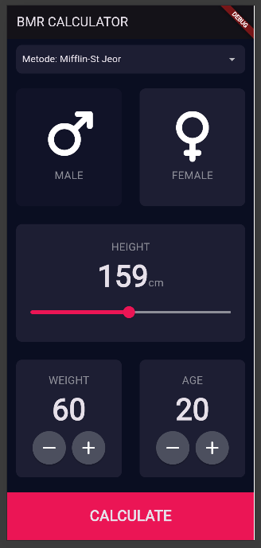
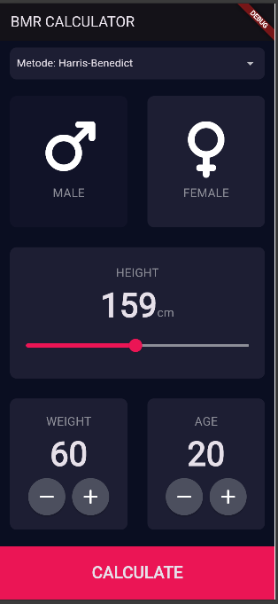
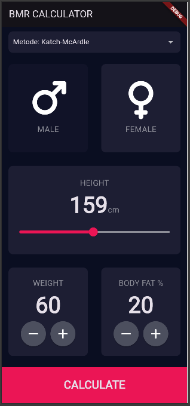
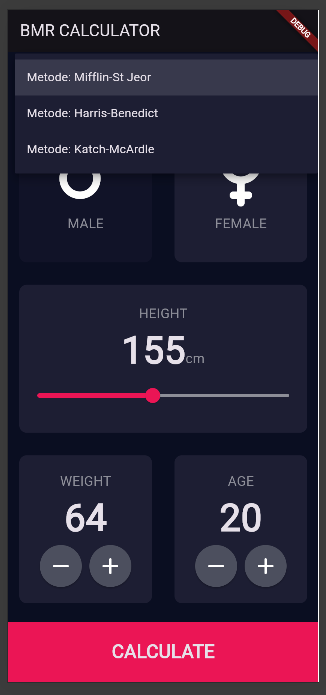
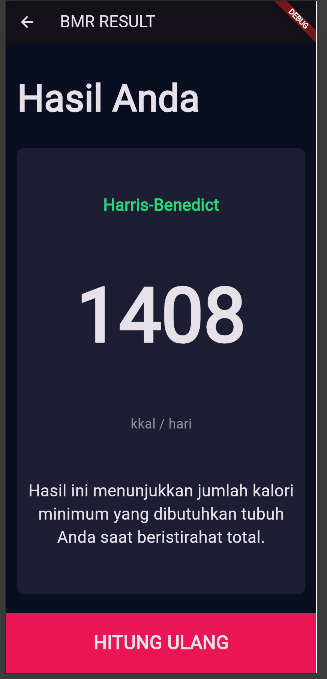
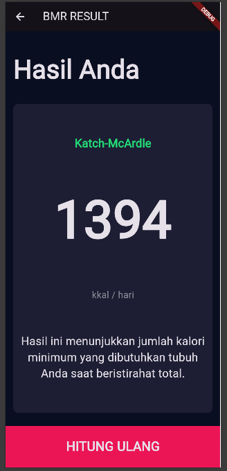

# BMR CALCULATOR

Aplikasi **BMR Calculator** adalah aplikasi berbasis mobile yang dibangun menggunakan framework **Flutter**. Aplikasi ini dirancang untuk membantu pengguna menghitung *Basal Metabolic Rate* (BMR) atau jumlah kalori minimal yang dibutuhkan tubuh saat beristirahat total, menggunakan tiga metode perhitungan ilmiah yang berbeda.

**Wijayaning Dewi Ramadhani - K3523076**

## 📝 Deskripsi Proyek
Merupakan tugas mata kuliah **Pemrograman Perangkat Bergerak (PPB)** Semester 5. Fokus utama aplikasi ini adalah memberikan akurasi perhitungan BMR dengan menyediakan opsi metode yang sesuai dengan kondisi fisik pengguna (termasuk kadar lemak tubuh).

### Fitur Utama:
* **Tiga Metode Perhitungan:**
    1.  **Mifflin-St Jeor:** Standar modern yang paling umum digunakan.
    2.  **Harris-Benedict:** Rumus klasik yang telah direvisi untuk akurasi lebih baik.
    3.  **Katch-McArdle:** Sangat akurat bagi pengguna yang mengetahui persentase lemak tubuh (*Body Fat*).
* **UI/UX Modern:** Menggunakan tema gelap (Dark Mode) yang nyaman di mata.
* **Slider Interaktif:** Memudahkan input tinggi badan.
* **Responsif:** Berjalan dengan baik di berbagai ukuran layar Android/iOS.

## 📸 Screenshots
Berikut adalah tampilan antarmuka aplikasi BMR Calculator:

| Halaman Input | Pemilihan Metode | Halaman Hasil |
| :---: | :---: | :---: |
| , ,  |  | , ,  |

